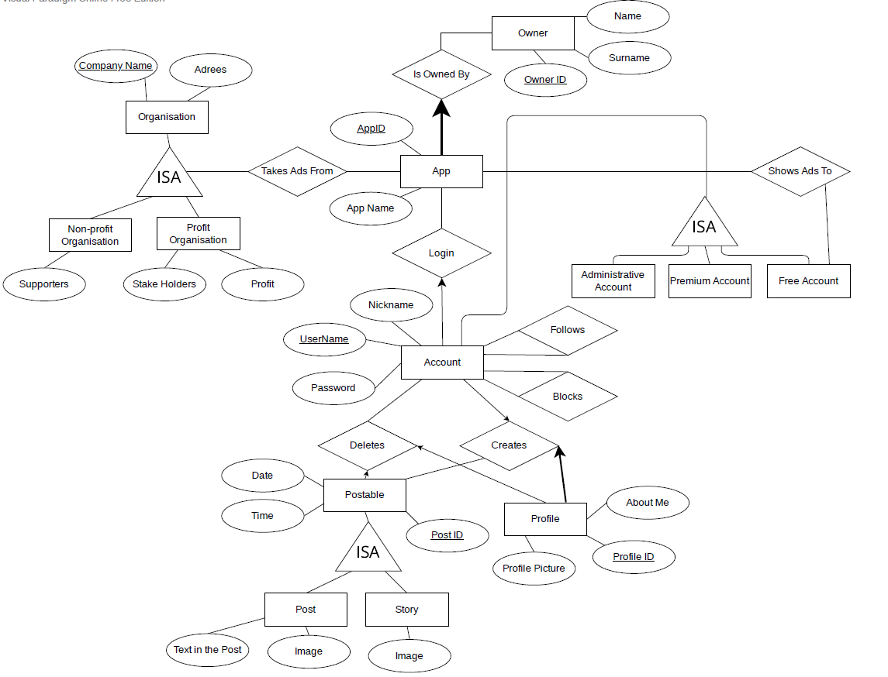

# SOAPP-DATABASE
This repository contains the SOAPP (Social Media Applications Database) which is an application programming interface to control social media applications and which is based on database operations. Focused on relational database, and used mysql and php. Description, and steps are in the pdf files and all coding implementations are available in the Soapp file.

Entity-Relationship Diagram of SOAPP

